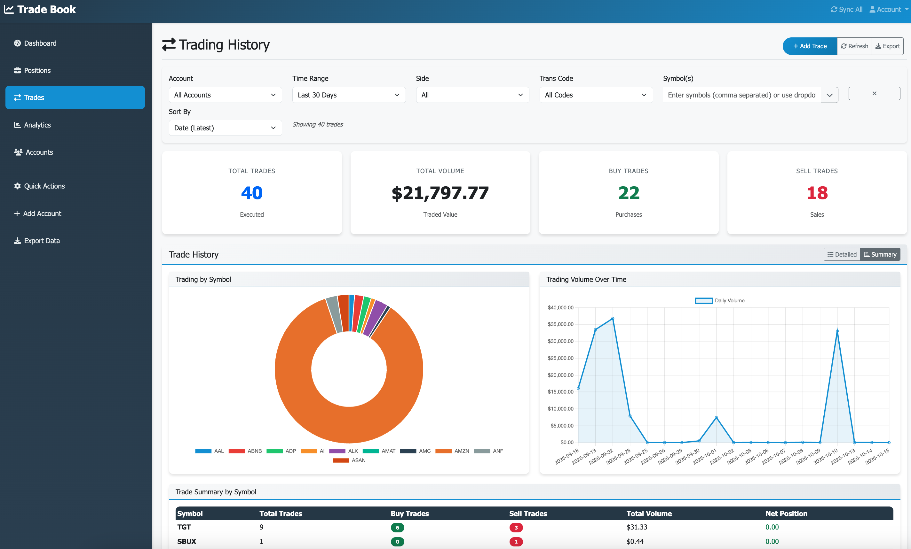

# Mantri Trade Book 

A comprehensive Python/Flask application for managing multiple trading accounts with advanced analytics, CSV import capabilities, and cross-provider support.

## 🚀 Features

### Import Trades from Multi-Providers
- **Multiple Brokers**: Support for Robinhood, Fidelity, WeBull, and Charles Schwab
- **Robinhood CSV Import**: Direct import of Robinhood transaction history
- **Deduplication**: Automatic detection and prevention of duplicate transactions
- **Format Support**: Standardized CSV format with activity date, trans codes, and amounts
- **Batch Processing**: Import thousands of transactions efficiently
- **Provider-Specific Features**: Tailored integration for each supported provider

### Enhanced Analytics
- **Cross-Account Analysis**: Compare performance across multiple accounts and providers
- **Instrument-Specific Analytics**: Deep dive into individual stock/option performance
- **P&L Over Time**: Detailed profit/loss tracking with daily, monthly, and yearly views
- **Transaction Code Analysis**: BTO, STO, BTC, STC breakdown and analytics
- **Multi-Account Filtering**: Filter analytics by specific accounts or providers
- **Search/Filters**: Filter by transaction codes, providers, and import sources




## 📋 Prerequisites
- Python 3.12 or higher
- Trading account(s) with any supported provider


## 🚀 Quick Start

### 1. Clone and Setup

```bash
git clone <repository-url>
cd mantri_trade_book

# Make setup script executable
chmod +x setup.sh

# Run setup script
./setup.sh
```

### 2. Initialize Database (Fresh Installation)

```bash
# Initialize fresh database
python init_db.py
```

### 3. Database Management (Optional)

```bash
# Use the database manager for various operations
python db_manager.py init     # Initialize fresh database
python db_manager.py backup   # Create database backup
python db_manager.py verify   # Verify database integrity
```

### 4. Run the Application

```bash
# Start the application
python app.py

# Or use the quick start script
python run.py
```

### 5. Access the Application

Open your browser and navigate to: `http://localhost:5000`

## 🎯 Usage Guide

### Adding Accounts

#### Option 1: API Authentication
1. Navigate to the **Accounts** page
2. Click **"Add Trading Account"**
3. Select your provider (Robinhood, Fidelity, WeBull, Schwab)
4. Choose **"API Authentication"**
5. Enter credentials and test connection
6. Save the account

#### Option 2: Manual Entry (CSV Import)
1. Navigate to the **Accounts** page
2. Click **"Add Trading Account"**
3. Select your provider
4. Choose **"Manual Entry"**
5. Enter account name only
6. Save the account
7. Import CSV data (see below)

### CSV Import Process

#### For Robinhood Users:
1. Download transaction history from Robinhood
2. In the account creation modal, select your CSV file
3. Preview the data to ensure proper formatting
4. Click "Import Data" to process transactions
5. Review import results (imported count, duplicates skipped)

#### CSV Format Requirements:
```csv
Activity Date,Process Date,Settle Date,Instrument,Description,Trans Code,Quantity,Price,Amount
10/14/2025,10/14/2025,10/15/2025,YOU,YOU 11/21/2025 Put $27.00,STO,2,$0.78,$155.91
```

### Database Setup for Production
```bash
# Initialize production database
python init_db.py

# Or use the database manager
python db_manager.py init

# Verify database integrity
python db_manager.py verify
```
## 🤝 Contributing

1. Fork the repository
2. Create a feature branch
3. Make your changes
4. Add tests for new features
5. Update documentation
6. Submit a pull request


## 📝 License

This project is licensed under the MIT License - see the LICENSE file for details.

## ⚠️ Disclaimer

This application is for educational and personal use only. Please ensure compliance with your broker's Terms of Service and API usage policies. Trading involves risk, and past performance does not guarantee future results.
